# Claude control-plane verification

Date: 2026-07-15  
Installed baseline: Claude Code 2.1.210, zmx 0.6.0, Dispatch 0.10.0  
Research target: supported Claude Code CLI and Agent View surfaces, not the
Claude Agent SDK

## Verdict

Dispatch can support durable, multi-turn Claude sessions without a persistent
PTY. The smallest trustworthy transport is one owned, serialized
`claude --resume <uuid> --print` subprocess per message. Dispatch chooses the
UUID, supplies per-invocation settings, receives structured stream output, and
combines its content-minimized hook with the owned CLI stream. No individual
hook, process exit, or output text is acceptance or completion authority.

The installed CLI proved this sequence:

1. choose a UUID and start a disposable session;
2. observe `UserPromptSubmit` with the same session UUID and a provider-generated
   `prompt_id`, then observe all prompt hooks settle and assistant/tool activity;
3. observe one or more `Stop` cycles with the same `prompt_id`, settling the final
   hook set before terminal result success and clean process exit;
4. start a fresh process with `--resume <uuid>` and complete another message;
5. interrupt an active owned process with SIGINT (exit 130, no `Stop`), then
   resume the same UUID successfully;
6. correlate concurrent completions by `prompt_id`, while also proving that
   concurrent order and duplicate suppression are not provider guarantees.

Agent View separately proved durable supervisor ownership, attention metadata,
human attach/reply, detach, stop, respawn, and cleanup. Its shell commands do
not expose a non-interactive reply primitive, so it is a supervision surface,
not Dispatch's first message transport.

zmx 0.6.0 can persist a PTY, but its raw send has no acknowledgement and can
return zero after a transport failure. Tagged source also shows that it always
logs PTY input bytes in recoverable hexadecimal. It is excluded from the first
implementation slice.

## Evidence rules

- Official documentation is a rolling surface. Retrieval date is 2026-07-15;
  local claims are tied to Claude Code 2.1.210 or zmx 0.6.0.
- Existing Claude sessions were inspected only as a count of metadata rows.
  No existing session was opened, messaged, interrupted, renamed, or read.
- Every live message was synthetic, used Haiku, and ran in a temporary Git
  repository with an explicit settings file.
- Hook capture retained only event/session/prompt IDs, bounded lifecycle
  fields, input key names, and synthetic markers. Prompts, model output,
  transcript paths, cwd, tool input/output, and raw transcripts were dropped.
- Exit status, stream replay, zmx status, and terminal scrollback are never
  treated alone as Claude acceptance or completion receipts.

## Source and version ledger

| Source | Retrieved/version | What it establishes | Evidence class |
| --- | --- | --- | --- |
| [CLI reference](https://code.claude.com/docs/en/cli-usage) | 2026-07-15 / rolling | print/stream JSON, session ID, resume/fork/name, settings, permissions, structured output, worktrees, remote control | documented |
| [Sessions](https://code.claude.com/docs/en/sessions) | 2026-07-15 / rolling | project-scoped durable UUIDs, names, resume, fork, concurrent transcript interleaving, local retention | documented |
| [Agent View](https://code.claude.com/docs/en/agent-view) | 2026-07-15 / research preview | background supervisor, short/full IDs, states, human reply/attach, stop/respawn/rm, lazy worktrees | documented + observed |
| [Hooks](https://code.claude.com/docs/en/hooks) | 2026-07-15 / rolling | schemas, ordering points, blocking/fail-open behavior, timeouts, `prompt_id`, attention and completion events | documented + observed |
| [Settings](https://code.claude.com/docs/en/settings) | 2026-07-15 / rolling | managed > CLI > local > project > user precedence; object/array merge behavior | documented + observed composition |
| [Remote Control](https://code.claude.com/docs/en/remote-control) | 2026-07-15 / research preview | outbound Anthropic relay, local execution, multi-device input, reconnection, product constraints | documented |
| [zmx docs](https://zmx.sh/) and [tagged source](https://github.com/neurosnap/zmx/tree/v0.6.0) | 0.6.0 | PTY ownership, raw send, no ACK, buffer/drop behavior, modes, input logging | primary source + fake target |
| Installed help and probes in `spikes/claude/` | Claude Code 2.1.210 / zmx 0.6.0 | actual flags, event shapes, identity, lifecycle, interrupt, concurrency, failure, cleanup | observed |

The packet's old `/docs/en/cli-reference` URL redirects; the current canonical
CLI page is `/docs/en/cli-usage`.

## Supported surfaces

### Print and stream JSON

`--input-format stream-json` and `--output-format stream-json` are print-mode
surfaces. `--replay-user-messages` only re-emits stdin messages; it is a
transport echo, not acceptance. `--include-hook-events` exposes hook starts and
responses, including exit/outcome, while the Dispatch hook independently sends
content-minimized events to the daemon.

The session UUID is available in the init/result stream and in every captured
hook. `--session-id` chooses it for a new session. `--resume <uuid>` adds another
turn from a fresh process. `--fork-session` creates a different UUID with copied
history.

### Agent View

`claude --bg` returns a short management ID. `claude agents --json` exposes the
full `sessionId` when available plus state, status, waiting reason, pid, kind,
name, and cwd. The probe observed:

```json
{
  "id": "518b912b",
  "sessionId": "518b912b-...",
  "state": "blocked",
  "status": "waiting",
  "waitingFor": "permission prompt",
  "kind": "background"
}
```

The short ID is a supervisor selector; the full UUID is the conversation
identity. A background session can move from its launch cwd into a Claude-managed
worktree before editing, so effective cwd is observed state, not immutable launch
metadata.

Human reply is supported through Agent View peek or an attached TUI. Shell
management is limited to list, attach, logs, stop/kill, respawn, and rm. `logs`
is diagnostic output. `rm` removes the Agent View entry/worktree but deliberately
leaves the local conversation resumable; it is not archive or transcript delete.

### Hooks and receipt joins

The observed minimum fields were:

| Event | Stable correlation | Meaning |
| --- | --- | --- |
| `SessionStart` | `session_id`, source | process/session lifecycle; source included `resume` |
| `UserPromptSubmit` | `session_id`, `prompt_id` | prompt reached the provider hook boundary before processing |
| `PermissionRequest` | session/prompt IDs, tool name | action needs a decision |
| `Notification` | session/prompt IDs, notification type | coarse attention signal |
| `PreToolUse` / `PostToolUse` | session/prompt/tool-use IDs | tool lifecycle; content omitted |
| `Stop` | `session_id`, `prompt_id` | one stop cycle began; a sibling hook may continue the turn |
| `StopFailure` | session/prompt IDs | API failure path; not observed live |
| `SessionEnd` | session ID, reason | process/session lifecycle, not message completion |

`UserPromptSubmit` is submission evidence, not acceptance. A sibling prompt hook
can exit 2 after the Dispatch observer succeeds; the CLI can still emit a success
result without assistant activity or `Stop`. Processing is confirmed only after
all prompt hooks settle successfully and the owned stream begins assistant/tool
activity for the correlated prompt.

`Stop` joins to the same `prompt_id`, but is repeatable: a sibling Stop hook can
continue the turn, producing later assistant activity and another Stop cycle.
Completion requires the final Stop hook set to settle without continuation,
followed by terminal result success and clean owned-process exit. It does not fire
on user interrupt and does not prove background tasks or session crons quiescent.

Per-invocation settings composed with existing settings: stream output showed
multiple existing `SessionStart`/`Stop` hooks plus the Dispatch hook. Dispatch
must never assume exclusive ownership or mutate user/project settings.

### Remote Control

Remote Control is an explicit Anthropic-hosted relay over outbound HTTPS/TLS;
execution stays local and browser/mobile/terminal inputs synchronize. It requires
subscription authentication, workspace trust, policy enablement, a long-running
local process, and approximately ten-minute outage bounds. It exposes no
documented local programmable send RPC. This is a future operator/product choice,
not the default local Dispatch transport.

### zmx

The isolated fake target confirmed the primary-source contract:

- simultaneous raw sends arrived `b` then `a` although `a` was launched first;
- a raw Ctrl-C send returned success but target completion still occurred;
- after session kill, raw send printed an unresponsive error and exited zero;
- successful send therefore proves neither target acceptance nor completion.

zmx also maintains a 256 KiB PTY input queue whose overflow can drop input
without sender notification. Version 0.6.0 logs PTY input bytes at debug level
and does not expose a disable/redaction control. Private modes reduce who can
read the logs but do not satisfy a no-raw-prompt-retention boundary.

## Lifecycle state machine

```mermaid
stateDiagram-v2
    [*] --> Known: choose UUID and persist lane
    Known --> Starting: spawn claude --session-id/--resume
    Starting --> FrameNotWritten: preflight failed before stdin
    Starting --> FrameMaybeWritten: stdin write began
    FrameMaybeWritten --> SubmittedObserved: Dispatch UserPromptSubmit observed
    SubmittedObserved --> ProcessingStarted: hooks settle without block and model/tool activity begins
    FrameMaybeWritten --> AcceptanceUnknown: transport or hook settlement lost
    ProcessingStarted --> Running: correlated model/tool activity
    Running --> NeedsAttention: permission/notification/elicitation
    NeedsAttention --> Running: supported human/provider response
    Running --> StopObserved: Stop with matching prompt_id
    StopObserved --> Running: settled sibling hook continues turn
    StopObserved --> Completed: final hooks settle, result succeeds, process exits cleanly
    Running --> CompletionUnknown: owned process lost or interrupted after processing began
    Running --> Failed: StopFailure or process failure
    AcceptanceUnknown --> Failed: explicit operator reconciliation
    Completed --> Known: process exited; session UUID remains resumable
    Failed --> Known: explicit recovery decision
```



Only one `Starting` through terminal attempt may exist per session. A process
generation and attempt ID prevent late hooks from a dead process from changing a
new attempt.

## Capability matrix

Every row is resolved. `Verified` may be a direct Claude primitive or a safe
Dispatch composition; `product-decision` means the primitive exists but the
cross-provider product semantics must be chosen; `unsupported` means the first
adapter must return a typed capability error.

| Capability | Status | Primitive / Dispatch composition | Acceptance and completion | Failure / recovery | Confidence |
| --- | --- | --- | --- | --- | --- |
| Durable identity | verified | caller-chosen UUID; Agent View also has separate short ID | UUID matches stream and hooks | resolve UUID in project/worktree scope; never route by mutable name | high, observed 2.1.210 |
| New | verified | persist UUID, preflight hook channel, spawn `--session-id UUID --print`; optional `--bg` is human-supervised mode | prompt hook settlement + owned activity; final settled Stop cycle + result/exit | retry only when proven no frame write began; otherwise operator reconciliation | high |
| Owned resume-for-send | verified | Dispatch starts `--resume UUID`; never managed `--continue` | `SessionStart(source=resume)` then ordinary aggregate receipts | stale/wrong-cwd lookup is typed not-found | high |
| Human Agent View attach | verified | human `claude attach SHORT_ID` to a known disposable Agent View entry | UI and ordinary hooks; not a Dispatch send transport | human supervision only; no shell reply RPC | high |
| Dispatch attach of an unmanaged ordinary session | unsupported | no content-free metadata validation primitive was proven | none | do not register writable authority from UUID alone | high |
| Send | verified | serialized fresh `--resume UUID --print` process per message | processing after aggregate prompt settlement + activity; completion after final Stop settlement/result/exit | any possible frame write plus loss is indeterminate; never auto-retry | high |
| Steer active turn | unsupported | no documented print-process steer RPC; TUI input semantics are not equivalent | none | expose unsupported, do not queue under a steer label | high |
| Durable queue/readiness | product-decision | Dispatch queue + one-writer lease; drain only after terminal attempt, empty background work, and healthy hooks | next aggregate receipt sequence | frame/acceptance/completion uncertainty blocks drain until explicit operator resolution | high evidence, policy open |
| Interject | product-decision | SIGINT verified owned process group, await exit, then start a new turn | exit proves transport interruption; new prompt needs normal receipts | not atomic; provider completion may remain unknown | high evidence, semantics open |
| Context injection | unsupported | no safe equivalent to Codex model-visible non-user context injection; system-prompt flags are launch configuration | none | expose unsupported; do not relabel a user message | high |
| Stop/interrupt | verified | SIGINT current verified owned print-process group; Agent View `stop` is separate whole-session UI | exit proves transport interruption; absence of `Stop` is expected | after processing, provider completion stays unknown; explicit operator abandonment can release queue | high |
| Tail/history | product-decision | live structured output/hooks are safe watch; Agent View logs and local JSONL contain content | event cursor, not scrollback | default history ingest remains off; explicit transcript policy required | high |
| Watch/events | verified | per-invocation hooks + owned structured output | hook IDs, occurrence order, prompt/session IDs | delivery-ID replay dedupe, generation fence, health timeout; same-UID trust is advisory | high |
| Rename | product-decision | `--name` at launch, `/rename` or Agent View UI later | metadata observation | no documented non-interactive rename command; UUID remains authority | medium |
| Archive/restore | unsupported | `rm` removes management entry/worktree but retains resumable transcript | none | do not call it archive/delete; resume is not restore from archive | high |
| Goal loop | product-decision | Dispatch-owned goals/triggers may send ordinary turns; Claude `/loop` is provider UI semantics | normal per-turn receipts | do not claim Codex goal parity | medium |
| Permissions/approval | verified | permission modes and `PermissionRequest` hook decisions | request/decision audit + later tool/Stop event | timeout/failure is explicit attention/unknown; never auto-allow by transport | high |
| User input/elicitation | product-decision | attention hooks + Agent View/attach human response | shared `prompt_id`; later `Stop` | no shell reply RPC; first slice surfaces attention but does not synthesize answers | high |
| Structured output | verified | print mode `--json-schema` and JSON/stream result | validated structured result + normal Stop | schema failure is typed provider failure; not an interactive-lane default | medium-high, documented/help |
| Rich input/files/images | product-decision | `--file` addresses provider file resources; Agent View supports human image paste | normal prompt receipt | local file/image stream contract not established; first slice text only | medium |
| Process restart/recovery | verified | fresh `--resume`; Agent View stop/respawn retained full UUID | `SessionStart(resume)` and later receipts | partition recovery by provider; do not call Codex resume for Claude | high |
| Duplicate/concurrent send | verified | provider processes both and generates distinct prompt IDs | each turn has independent aggregate receipt cycles | enforce one writer; duplicate request ID returns stored receipt; ambiguous attempt not retried | high |
| Remote/mesh compatibility | product-decision | Remote Control is Anthropic relay; Dispatch mesh remains owning-daemon execution | provider hooks at owner | no private endpoint or shared remote process; future explicit config/policy | high |

## Failure and recovery matrix

| Failure | Observed/documented result | Owner | Required recovery |
| --- | --- | --- | --- |
| Preflight fails before stdin | no frame write | Claude runtime | fail before submission; bounded retry with same request ID is safe |
| Transport loss after write begins | frame may have reached Claude; no conclusive receipt | Claude runtime + operator | mark acceptance unknown; block queue; operator can wait, inspect content-free runtime facts, or explicitly abandon ambiguity before a new send |
| Process dies after processing starts | processing evidence but no final settled Stop/result/exit | Claude runtime + operator | mark completion unknown; never resend automatically; explicit abandonment releases queue but preserves unknown provider fact |
| SIGINT during active turn | exit 130, no new `Stop`; same UUID resumable | Claude runtime | record transport interruption; after processing starts retain completion unknown until operator abandons or later evidence resolves it |
| Prompt hook block after observer | Dispatch hook succeeds, sibling exits 2, no assistant/Stop, result may say success | hook reducer | submission only; do not mark processing |
| Stop hook continuation | repeated Stop cycles with same prompt ID | hook reducer | retain each occurrence; only final settled cycle plus result/exit completes |
| Hook exit 1 | prompt may proceed | hook ingest | mark hook unhealthy/acceptance unknown unless complete aggregate evidence exists |
| Hook timeout | hook response cancelled/exit 1; prompt proceeds | hook ingest | same as exit 1; never interpret as rejection |
| Duplicate request | two provider turns if sent twice | Dispatch | dedupe before spawn by durable Dispatch message ID |
| Concurrent writers | both produced turns; ordering is not launch order | Dispatch | single-writer transaction/lease per session |
| Permission/user input | hooks + Agent View waiting metadata | Dispatch attention reducer + human | durable inbox item; first slice requires attach/Agent View response |
| Daemon restart | Claude transcript persists; owned process may be gone | Dispatch supervisor | fence old generation, inspect pid, resume only on next explicit send |
| zmx loss | send may error text and still exit zero | zmx adapter | excluded; if ever enabled, receipts must come only from Claude hooks |
| Stale session/cwd | resume lookup is project/worktree scoped | selector/runtime | store canonical launch/effective cwd and return typed stale/not-found |

## Security and privacy findings

- Never retain raw hook input by default. Validate size/type, extract bounded
  fields, drop prompt/transcript/tool/message content, then persist.
- A hook command is executable configuration. Generate an owner-only settings
  file in Dispatch runtime state, use argv-safe process creation, and never
  interpolate user text into a shell command.
- Give each process generation a random nonce. The Dispatch hook returns it in
  structured hook output so the owned stream can distinguish that helper and
  reject stale generations. The nonce is a misrouting fence, not authentication
  against same-UID sibling hooks, repository code, or tools.
- Correlate `UserPromptSubmit` to the only persisted in-flight envelope by
  provider UUID, generation, and one-writer lease. Persist the provider
  `prompt_id`; do not retain a prompt digest or expose a marker to the model.
- Treat the OS user and Claude permission/sandbox policy as the security boundary.
  Same-UID hook observations are advisory and require owned-stream corroboration.
- Preflight the Dispatch `SessionStart` hook response before writing a prompt.
  Managed settings can disable hooks; missing nonce aborts before submission.
- User/project/managed hooks continue to run. Dispatch settings add one hook and
  never weaken permissions or replace settings files.
- Treat terminal output, Agent View logs, local transcripts, and zmx history/logs
  as content-bearing. They are outside default receipt ingestion.
- Do not enable Remote Control automatically. It changes external routing,
  authentication, availability, and policy boundaries.
- Session names, short IDs, titles, and cwd are selectors/metadata, never
  authorization. Route on `(provider, full session UUID)` plus local lane key.

## Contradictions and confidence limits

- Current official docs are newer than the installed binary in places. Rows
  based only on rolling docs/help are medium confidence until an implementation
  fixture pins the installed event.
- Agent View offers human reply, refining the older statement that it has no
  send path. It still lacks a documented scriptable reply command.
- `Stop` is a repeatable cycle boundary, not by itself completion, delivery
  acceptance, user interrupt, API failure, or whole-session quiescence.
- zmx `run` completion markers concern shell commands, not interactive Claude
  turns. Raw `send` remains fire-and-forget.
- Concurrent `--resume` succeeds, but official docs and observed order both make
  it unsafe for an ordered Dispatch queue.

## Reproduction and cleanup

The tracked scripts in `spikes/claude/` are content-minimizing fixtures. Exact
commands and sanitized sequences are documented there. The run used one temp
repository, two disposable Agent View entries, one isolated zmx fake session,
and print-mode UUIDs. Both Agent View entries were stopped and removed, the zmx
namespace returned zero sessions, and no research process remained.

Claude intentionally retains local resumable conversation files for its normal
retention period; the supported `rm` command does not delete those transcripts.
The research did not locate, read, or manually delete transcript files. That
provider retention is why `archive/delete` is marked unsupported rather than
pretending cleanup has stronger semantics.
