# Claude control-plane verification

Date: 2026-07-15  
Installed baseline: Claude Code 2.1.210, zmx 0.6.0, Dispatch 0.10.0  
Research target: supported Claude Code CLI and Agent View surfaces, not the
Claude Agent SDK

## Verdict

Dispatch can support durable, multi-turn **headless** Claude sessions. For
human-coexistent control, Crew supplies a concrete preferred design: keep the
Agent View background owner intact, host one persistent `claude agents` cockpit
in zmx, and drive Claude's own guarded quick-reply UI. zmx is the terminal/VT
substrate, never the Claude receipt protocol.

That route is not yet verified end to end for Dispatch. Installed zmx 0.6.0 lacks
revisioned VT snapshots, named-key input, acknowledged/serialized conditional
writes, and input-log redaction. Agent View also has not exposed aggregate
sibling-hook settlement plus owned provider activity without raw transcript
access. DIS-54 owns those blockers and the pinned live proof.

Fresh `claude --resume <uuid> --print` can
complete while an ordinary TUI remains attached, yet the two processes continue
from different in-memory histories. The TUI did not display or inherit the
external turn, and a later fresh resume saw the TUI branch but not the externally
completed turn. This is split-brain continuity, not a shared session transport.

The recommended fallback headless transport is one Dispatch-owned persistent
print process using stream-JSON input/output, with exclusive ownership and the
same aggregate hook receipts. It completed multiple serialized turns on one
process. Concurrent external resume remained unsafe and invisible to the owner,
so the runtime must reject or fence every second owner. A human handoff requires
the Dispatch owner to exit before the TUI starts and an explicit hand-back after
the TUI exits. It must not displace the Agent View cockpit candidate merely
because it is simpler.

The installed CLI proved this sequence:

1. choose a UUID and start a disposable session;
2. observe `UserPromptSubmit` with the same session UUID and a provider-generated
   `prompt_id`, then observe all prompt hooks settle and assistant/tool activity;
3. observe one or more `Stop` cycles with the same `prompt_id`, settling the final
   hook set before terminal per-message result success; require clean exit when
   the owner process terminates;
4. send a second message through the same persistent stream owner and complete
   it; after owner loss, start one fresh `--resume <uuid>` owner;
5. interrupt an active owned process with SIGINT (exit 130, no `Stop`), then
   resume the same UUID successfully;
6. correlate concurrent completions by `prompt_id`, while also proving that
   concurrent order and duplicate suppression are not provider guarantees.

Agent View separately proved durable supervisor ownership, attention metadata,
human attach/reply, detach, stop, respawn, and cleanup. A live background owner
rejects fresh `--resume` with exit 1 even when idle and when human-attached; after
the owner is stopped, resume succeeds. Its shell commands do not expose a
non-interactive reply primitive, but its cockpit UI does expose guarded quick
reply. Crew's current implementation normalizes to home, resolves a concrete row,
opens detail and verifies title, returns and re-verifies selection, opens `❯ reply`
with a literal-space text send, then types/submits. This is the candidate Dispatch
send path once zmx and receipt gates are satisfied.

zmx 0.6.0 can persist the cockpit PTY, but its raw send has no acknowledgement and can
return zero after a transport failure. Tagged source also shows that it always
logs PTY input bytes in recoverable hexadecimal. It is excluded as shipped, not
rejected as an architecture substrate: DIS-54 may extend/pin it with the required
VT, transaction, and redaction contract.

## Evidence rules

- Official documentation is a rolling surface. Retrieval date is 2026-07-15;
  local claims are tied to Claude Code 2.1.210 or zmx 0.6.0.
- Existing Claude sessions were inspected only as a count of metadata rows.
  No existing session was opened, messaged, interrupted, renamed, or read.
- Every live message was synthetic, used Haiku, and ran in a temporary Git
  repository with an explicit settings file.
- Hook capture retained only event/session/prompt IDs, bounded lifecycle
  fields, input key names, and synthetic markers. Prompts, model output,
  transcript paths, cwd, tool input/output, and raw transcripts were dropped.
- Exit status, stream replay, zmx status, and terminal scrollback are never
  treated alone as Claude acceptance or completion receipts.
- A disposable Agent View launch with explicit per-session settings, empty
  setting sources, and an empty strict MCP config nevertheless changed the
  already captured mtime/size/digest metadata of `~/.claude/settings.json` at
  launch time. Its contents were not inspected or retained, and the file was not
  restored or edited by the research. This product-side global mutation freezes
  further Agent View launch probes in this run and is an additional integration
  risk.

## Source and version ledger

| Source | Retrieved/version | What it establishes | Evidence class |
| --- | --- | --- | --- |
| [CLI reference](https://code.claude.com/docs/en/cli-usage) | 2026-07-15 / rolling | print/stream JSON, session ID, resume/fork/name, settings, permissions, structured output, worktrees, remote control | documented |
| [Sessions](https://code.claude.com/docs/en/sessions) | 2026-07-15 / rolling | project-scoped durable UUIDs, names, resume, fork, concurrent transcript interleaving, local retention | documented |
| [Agent View](https://code.claude.com/docs/en/agent-view) | 2026-07-15 / research preview | background supervisor, short/full IDs, states, human reply/attach, stop/respawn/rm, lazy worktrees | documented + observed |
| [Hooks](https://code.claude.com/docs/en/hooks) | 2026-07-15 / rolling | schemas, ordering points, blocking/fail-open behavior, timeouts, `prompt_id`, attention and completion events | documented + observed |
| [Settings](https://code.claude.com/docs/en/settings) | 2026-07-15 / rolling | managed > CLI > local > project > user precedence; object/array merge behavior | documented + observed composition |
| [Remote Control](https://code.claude.com/docs/en/remote-control) | 2026-07-15 / research preview | outbound Anthropic relay, local execution, multi-device input, reconnection, product constraints | documented |
| [zmx docs](https://zmx.sh/) and [tagged source](https://github.com/neurosnap/zmx/tree/v0.6.0) | 0.6.0 | PTY ownership, raw send, no ACK, buffer/drop behavior, modes, input logging | primary source + fake target |
| Installed help and probes in `spikes/claude/` | Claude Code 2.1.210 / zmx 0.6.0 | actual flags, event shapes, identity, lifecycle, interrupt, concurrency, failure, cleanup | observed |
| Crew `sendClaudeAgentsMessage` and operating lessons | local worktree at `4a24fdb`; committed live quick-reply lesson plus current target-identity hardening | home/row/detail/return/reply guards; literal-space behavior; UI automation is not receipt | implementation + dogfood evidence; Dispatch/zmx proof pending |
| Coordinator-supplied read-only zmx cockpit observation | 2026-07-15 / zmx 0.6.0 | alternate-screen structure and parseable plain history; Agent View JSON supplies full identities for visible blocked rows | non-content architectural evidence from an existing user-owned session; no input or mutation; not delivery proof |

The packet's old `/docs/en/cli-reference` URL redirects; the current canonical
CLI page is `/docs/en/cli-usage`.

## Supported surfaces

### Print and stream JSON

`--input-format stream-json` and `--output-format stream-json` are print-mode
surfaces. `--replay-user-messages` only re-emits stdin messages; it is a
transport echo, not acceptance. `--include-hook-events` exposes hook starts and
responses, including exit/outcome, while the Dispatch hook independently sends
content-minimized events to the daemon.

The session UUID is available in the init/result stream and in every captured
hook. `--session-id` chooses it for a new session. `--resume <uuid>` can create a
new owner after prior-owner exit; using it beside a live ordinary or stream owner
is unsafe despite apparent success. `--fork-session` creates a different UUID
with copied history.

### Agent View

`claude --bg` returns a short management ID. `claude agents --json` exposes the
full `sessionId` when available plus state, status, waiting reason, pid, kind,
name, and cwd. The probe observed:

```json
{
  "id": "518b912b",
  "sessionId": "518b912b-...",
  "state": "blocked",
  "status": "waiting",
  "waitingFor": "permission prompt",
  "kind": "background"
}
```

The short ID is a supervisor selector; the full UUID is the conversation
identity. A background session can move from its launch cwd into a Claude-managed
worktree before editing, so effective cwd is observed state, not immutable launch
metadata.

The official [Agent View documentation](https://code.claude.com/docs/en/agent-view)
defines the provider-owned reply path: `Space` opens peek and `Enter` sends its
reply to the selected session. If an ordinary reply cannot reach the background
service or send fails, Claude saves it as that session's next prompt; `!` Bash
replies are the documented exception. A row whose process exited remains
peekable/replyable/attachable and the supervisor restarts it from saved state.
These are supervisor product semantics, not a public reply RPC or a Dispatch
receipt.

`claude agents --json --all` includes completed rows and supplies the roster
fields used for identity. UI filters (`a:<name>`, `s:<state>`, PR/URL) may help
navigation but never replace the full UUID join. Agent View is a research preview
whose UI/shortcuts can change, so the adapter must pin/version-gate every guard.
Shell management remains limited to list, attach, logs, stop/kill, respawn, and
rm. `logs` is diagnostic output. `rm` removes the Agent View entry/worktree but
deliberately leaves the local conversation resumable; it is not archive or
transcript delete.

### Ownership and coexistence

Disposable probes covered all supported ownership combinations without reading
existing sessions:

- **Ordinary TUI plus fresh resume:** the external process completed with normal
  receipts while the TUI stayed attached, but no external output appeared in the
  TUI. The next TUI turn reported that the external marker was absent. After the
  TUI exited, a fresh resume saw the TUI turns and still did not see the external
  marker. One earlier run also produced `StopFailure`/context-limit failure on the
  first post-external TUI turn. Process liveness therefore does not imply coherent
  shared history.
- **Agent View background plus resume:** the live background pid remained the
  owner after its turn reached `done/idle`; fresh resume failed with exit 1 and a
  documented “currently running as a background agent” error. The same rejection
  occurred while a human TUI was attached. Human input continued normally, and
  resume succeeded only after explicit Agent View stop.
- **Persistent stream owner plus resume:** two messages completed serially through
  one stream owner. A concurrent fresh resume also returned success, but the
  owner's next turn could not see the external marker. Persistent ownership fixes
  per-turn startup and preserves headless continuity only when exclusive.

Agent View quick reply is a real UI primitive into the existing background owner.
Crew proves the guarded navigation shape and the critical literal-space behavior,
while explicitly warning that UI typing is not delivery proof. Dispatch should
host this cockpit in zmx so a human and automation observe one Agent View owner,
then use Claude hooks/owned evidence—not zmx status or scrollback—for receipts.

The installed pieces are still insufficient. Coordinator-supplied read-only
evidence from an existing user-owned cockpit shows that zmx 0.6.0 `history --vt`
can render Agent View's alternate screen with cursor/style state and that plain
history is structurally parseable; independent `claude agents --json` supplies
the exact full session identities for visible blocked rows. This validates the
API-identity plus VT-choreography composition, but not safe control. zmx still
provides no bounded current-screen revision, conditional atomic input
transaction, named keys, send ACK, or input-log redaction. Concurrent human
keystrokes can invalidate selection between screen reads; a safe provider must
abort on revision change and atomically submit payload plus Enter under a short
UI transaction lease. Even after a PTY write ACK, acceptance remains blocked
until aggregate prompt-hook settlement and owned provider activity can be
corroborated without reading raw transcripts.

The regression criterion is one coherent history, not two live processes. An
acceptable future transport must prove that the attached human observes the
Dispatch turn, the next human turn contains it in context, and the next Dispatch
turn contains that human turn, all with ordered aggregate receipts. The checked-in
coexistence fixture encodes the current negative outcomes so liveness cannot be
mistaken for continuity.

### Hooks and receipt joins

The observed minimum fields were:

| Event | Stable correlation | Meaning |
| --- | --- | --- |
| `SessionStart` | `session_id`, source | process/session lifecycle; source included `resume` |
| `UserPromptSubmit` | `session_id`, `prompt_id` | prompt reached the provider hook boundary before processing |
| `PermissionRequest` | session/prompt IDs, tool name | action needs a decision |
| `Notification` | session/prompt IDs, notification type | coarse attention signal |
| `PreToolUse` / `PostToolUse` | session/prompt/tool-use IDs | tool lifecycle; content omitted |
| `Stop` | `session_id`, `prompt_id` | one stop cycle began; a sibling hook may continue the turn |
| `StopFailure` | session/prompt IDs | API failure path; not observed live |
| `SessionEnd` | session ID, reason | process/session lifecycle, not message completion |

`UserPromptSubmit` is submission evidence, not acceptance. A sibling prompt hook
can exit 2 after the Dispatch observer succeeds; the CLI can still emit a success
result without assistant activity or `Stop`. Processing is confirmed only after
every sibling prompt hook reaches terminal settlement, none blocks, and the owned
stream begins assistant/tool activity for the correlated prompt. Terminal
nonblocking exit-1/cancelled outcomes degrade hook health but do not erase that
owned processing evidence; missing/nonterminal settlement leaves acceptance
unknown.

`Stop` joins to the same `prompt_id`, but is repeatable: a sibling Stop hook can
continue the turn, producing later assistant activity and another Stop cycle.
Completion requires the final Stop hook set to settle without continuation,
followed by terminal per-message result success. Clean process exit is required
when an owner generation terminates, not for each message. `Stop` does not fire
on user interrupt and does not prove background tasks or session crons quiescent.

Per-invocation settings composed with existing settings: stream output showed
multiple existing `SessionStart`/`Stop` hooks plus the Dispatch hook. Dispatch
must never assume exclusive ownership or mutate user/project settings.

### Remote Control

Remote Control is an explicit Anthropic-hosted relay over outbound HTTPS/TLS;
execution stays local and browser/mobile/terminal inputs synchronize. It requires
subscription authentication, workspace trust, policy enablement, a long-running
local process, and approximately ten-minute outage bounds. It exposes no
documented local programmable send RPC. This is a future operator/product choice,
not the default local Dispatch transport.

### zmx

The isolated fake target confirmed the primary-source contract:

- simultaneous raw sends arrived `b` then `a` although `a` was launched first;
- a raw Ctrl-C send returned success but target completion still occurred;
- after session kill, raw send printed an unresponsive error and exited zero;
- successful send therefore proves neither target acceptance nor completion.

[zmx v0.6.0 source](https://github.com/neurosnap/zmx/blob/v0.6.0/src/main.zig)
keeps one Ghostty terminal and PTY per session and broadcasts PTY output to all
clients. `history` serializes that internal terminal as plain text, VT, or HTML;
it is stronger than a file-tail read but still lacks a bounded viewport and
monotonic snapshot generation. Input from a nonleader client can transfer the
leader, which alone controls PTY/Ghostty resize, so automation needs a lease
around both revision and leader state.

`send` writes an `Input` IPC frame and returns without a daemon acknowledgement.
The daemon queues at most 256 KiB; overflow drops the new payload without an error
to the sender, though a local warning is logged. Version 0.6.0 fixes logging at
debug, records raw PTY input bytes (potentially twice), and exposes file modes but
no disable/redaction control. Private modes reduce who can read the logs but do
not satisfy a no-raw-prompt-retention boundary.

## Lifecycle state machine

```mermaid
stateDiagram-v2
    [*] --> Known: choose UUID and persist lane
    Known --> StartingOwner: spawn claude --session-id/--resume only with exclusive ownership
    StartingOwner --> OwnerReady: SessionStart preflight settles
    StartingOwner --> FrameNotWritten: preflight failed before stdin
    OwnerReady --> FrameMaybeWritten: stdin frame write began
    FrameMaybeWritten --> SubmittedObserved: Dispatch UserPromptSubmit observed
    SubmittedObserved --> ProcessingStarted: hooks settle without block and model/tool activity begins
    FrameMaybeWritten --> AcceptanceUnknown: transport or hook settlement lost
    ProcessingStarted --> Running: correlated model/tool activity
    Running --> NeedsAttention: permission/notification/elicitation
    NeedsAttention --> Running: supported human/provider response
    Running --> StopObserved: Stop with matching prompt_id
    StopObserved --> Running: settled sibling hook continues turn
    StopObserved --> Completed: final hooks settle and per-message result succeeds
    Running --> CompletionUnknown: owned process lost or interrupted after processing began
    Running --> Failed: StopFailure or process failure
    AcceptanceUnknown --> Failed: explicit operator reconciliation
    Completed --> OwnerReady: owner remains healthy for next serialized frame
    OwnerReady --> Known: owner exits cleanly; session UUID remains resumable
    Failed --> Known: explicit recovery decision
```



Only one owner and one nonterminal message attempt may exist per session. A
process generation and attempt ID prevent late hooks from a dead process from
changing a new attempt. An idle owner still owns the session.

## Capability matrix

Every row is resolved. `Verified` may be a direct Claude primitive or a safe
Dispatch composition; `product-decision` means the primitive exists but the
cross-provider product semantics must be chosen; `unsupported` means the first
adapter must return a typed capability error; `blocked` means the required
capability has no acceptable primitive under the pinned versions.

| Capability | Status | Primitive / Dispatch composition | Acceptance and completion | Failure / recovery | Confidence |
| --- | --- | --- | --- | --- | --- |
| Durable identity | verified | caller-chosen UUID; Agent View also has separate short ID | UUID matches stream and hooks | resolve UUID in project/worktree scope; never route by mutable name | high, observed 2.1.210 |
| New | verified | headless qualifier: persist UUID, spawn exclusive persistent `--session-id UUID --print` stream owner, settle preflight; optional `--bg` is separate human-supervised mode | prompt hook settlement + owned activity; final settled Stop cycle + terminal per-message result | retry only when proven no frame write began; otherwise operator reconciliation | high |
| Post-exit resume owner | verified | Dispatch starts one `--resume UUID` stream owner only after proven prior-owner exit; never managed `--continue` | `SessionStart(source=resume)` then ordinary aggregate receipts | stale/wrong-cwd/owner-conflict are typed failures | high |
| Human Agent View attach | verified | human `claude attach SHORT_ID` to a known disposable Agent View entry | UI and ordinary hooks; not a Dispatch send transport | human supervision only; no shell reply RPC | high |
| Preserve attached human while Dispatch sends | blocked | preferred candidate: zmx-hosted Agent View cockpit + target-safe quick reply; same background owner remains authoritative | not yet sufficient: guarded PTY write needs aggregate hook settlement + owned provider activity | DIS-54 adds revisioned snapshot/atomic input/redaction and pinned live proof; abort on human revision race | medium-high design confidence; Dispatch proof blocked |
| Dispatch attach of an unmanaged ordinary session | unsupported | no content-free metadata validation primitive was proven | none | do not register writable authority from UUID alone | high |
| Headless send | verified | serialized messages through one exclusive persistent stream-JSON owner; fresh `--resume UUID` creates the next owner only after proven prior-owner exit | processing after aggregate prompt settlement + activity; completion after final Stop settlement/result; process exit is required when the owner terminates | any possible frame write plus loss is indeterminate; never auto-retry; reject second owners | high |
| Steer active turn | unsupported | no documented print-process steer RPC; TUI input semantics are not equivalent | none | expose unsupported, do not queue under a steer label | high |
| Durable queue/readiness | product-decision | Dispatch queue + one-writer lease; drain only after terminal attempt, empty background work, and healthy hooks | next aggregate receipt sequence | frame/acceptance/completion uncertainty blocks drain until explicit operator resolution | high evidence, policy open |
| Interject | product-decision | SIGINT verified owned process group, await exit, then start a new turn | exit proves transport interruption; new prompt needs normal receipts | not atomic; provider completion may remain unknown | high evidence, semantics open |
| Context injection | unsupported | no safe equivalent to Codex model-visible non-user context injection; system-prompt flags are launch configuration | none | expose unsupported; do not relabel a user message | high |
| Stop/interrupt | verified | SIGINT current verified owned print-process group; Agent View `stop` is separate whole-session UI | exit proves transport interruption; absence of `Stop` is expected | after processing, provider completion stays unknown; explicit operator abandonment can release queue | high |
| Tail/history | product-decision | live structured output/hooks are safe watch; Agent View logs and local JSONL contain content | event cursor, not scrollback | default history ingest remains off; explicit transcript policy required | high |
| Watch/events | verified | per-invocation hooks + owned structured output | hook IDs, occurrence order, prompt/session IDs | delivery-ID replay dedupe, generation fence, health timeout; same-UID trust is advisory | high |
| Rename | product-decision | `--name` at launch, `/rename` or Agent View UI later | metadata observation | no documented non-interactive rename command; UUID remains authority | medium |
| Archive/restore | unsupported | `rm` removes management entry/worktree but retains resumable transcript | none | do not call it archive/delete; resume is not restore from archive | high |
| Goal loop | product-decision | Dispatch-owned goals/triggers may send ordinary turns; Claude `/loop` is provider UI semantics | normal per-turn receipts | do not claim Codex goal parity | medium |
| Permissions/approval | verified | permission modes and `PermissionRequest` hook decisions | request/decision audit + later tool/Stop event | timeout/failure is explicit attention/unknown; never auto-allow by transport | high |
| User input/elicitation | product-decision | attention hooks + Agent View/attach human response | shared `prompt_id`; later `Stop` | no shell reply RPC; first slice surfaces attention but does not synthesize answers | high |
| Structured output | verified | print mode `--json-schema` and JSON/stream result | validated structured result + normal Stop | schema failure is typed provider failure; not an interactive-lane default | medium-high, documented/help |
| Rich input/files/images | product-decision | `--file` addresses provider file resources; Agent View supports human image paste | normal prompt receipt | local file/image stream contract not established; first slice text only | medium |
| Process restart/recovery | verified | after proven owner exit, fresh `--resume`; Agent View stop/respawn retained full UUID | `SessionStart(resume)` and later receipts | never resume while an ordinary/stream owner may remain; require explicit ownership reconciliation | high |
| Duplicate/concurrent send | verified | provider processes both and generates distinct prompt IDs | each turn has independent aggregate receipt cycles | enforce one writer; duplicate request ID returns stored receipt; ambiguous attempt not retried | high |
| Remote/mesh compatibility | product-decision | Remote Control is Anthropic relay; Dispatch mesh remains owning-daemon execution | provider hooks at owner | no private endpoint or shared remote process; future explicit config/policy | high |

## Failure and recovery matrix

| Failure | Observed/documented result | Owner | Required recovery |
| --- | --- | --- | --- |
| Preflight fails before stdin | no frame write | Claude runtime | fail before submission; bounded retry with same request ID is safe |
| Transport loss after write begins | frame may have reached Claude; no conclusive receipt | Claude runtime + operator | mark acceptance unknown; block queue; operator can wait, inspect content-free runtime facts, or explicitly abandon ambiguity before a new send |
| Process dies after processing starts | processing evidence but no final settled Stop/per-message result | Claude runtime + operator | mark completion unknown; never resend automatically; explicit abandonment releases queue but preserves unknown provider fact |
| SIGINT during active turn | exit 130, no new `Stop`; same UUID resumable | Claude runtime | record transport interruption; after processing starts retain completion unknown until operator abandons or later evidence resolves it |
| Prompt hook block after observer | Dispatch hook succeeds, sibling exits 2, no assistant/Stop, result may say success | hook reducer | submission only; do not mark processing |
| Stop hook continuation | repeated Stop cycles with same prompt ID | hook reducer | retain each occurrence; only final settled cycle plus terminal per-message result completes |
| Hook exit 1 | prompt may proceed | hook ingest | wait for every sibling's terminal settlement; if none blocks and owned activity follows, mark processing with degraded hook health; otherwise acceptance remains unknown |
| Hook timeout | hook response cancelled/exit 1; prompt proceeds | hook ingest | same terminal-settlement rule as exit 1; never interpret as rejection |
| Duplicate request | two provider turns if sent twice | Dispatch | dedupe before spawn by durable Dispatch message ID |
| Concurrent writers | both produced turns; ordering is not launch order | Dispatch | single-writer transaction/lease per session |
| Fresh resume while ordinary TUI attached | both processes can complete but histories diverge; external turn was absent from the TUI and later resume | Claude runtime + operator | mark ownership conflict; stop sends; explicit human handoff/reconciliation; never claim shared continuity |
| Fresh resume while stream owner lives | external process can complete but its turn is absent from the continuing owner | Dispatch supervisor | reject second owner by durable lease/process identity; after uncertainty, block until operator resolves ownership |
| Fresh resume while Agent View owner lives | exit 1, owner remains coherent and human-usable | Agent View | attach for human use or stop owner before a later resume; no Dispatch send during ownership |
| Cockpit target/detail/reply guard mismatch | Crew path fails closed before payload | cockpit reducer | renormalize home and retry only before any payload write; never fall back to raw send |
| Human changes cockpit revision | target/input state may have moved | hardened zmx transaction | abort before payload with `cockpit_changed`; reacquire snapshot and re-run every identity guard |
| Cockpit loss after possible payload write | PTY write/Enter may have reached Agent View | cockpit transport + operator | acceptance indeterminate; no automatic retry; wait for aggregate receipts or explicitly abandon |
| Cockpit restart | Agent View background owner continues independently | zmx supervisor | restart cockpit only, re-resolve full UUID/row, then re-run guards; never resume the worker |
| Cockpit hook/activity gap | UI write ACK without aggregate hook settlement and owned provider activity | receipt reducer | keep capability blocked and attempt unaccepted; transcript metadata/roster state cannot promote it |
| Permission/user input | hooks + Agent View waiting metadata | Dispatch attention reducer + human | durable inbox item; first slice requires attach/Agent View response |
| Daemon restart | Claude transcript persists; owned process may be gone | Dispatch supervisor | fence old generation, inspect pid, resume only on next explicit send |
| zmx loss | send may error text and still exit zero | zmx adapter | excluded; if ever enabled, receipts must come only from Claude hooks |
| Stale session/cwd | resume lookup is project/worktree scoped | selector/runtime | store canonical launch/effective cwd and return typed stale/not-found |

## Transport decision table

| Candidate | Continuity | Delivery correlation | Human coexistence | Interrupt / restart | Privacy / logging | Implementation cost | Verdict |
| --- | --- | --- | --- | --- | --- | --- | --- |
| Exclusive persistent stream-JSON owner | verified across multiple serialized turns while one owner lives | strongest: owned frames, stream activity, aggregate hooks, prompt IDs | no supported attached TUI; concurrent resume splits history | owned process group; after proven exit, resume UUID as a new owner | no extra PTY logger; retain only normalized events | medium | recommended headless base, but does not satisfy seamless coexistence |
| Fresh `--resume --print` per turn | verified only with no other live owner | strong per-process stream + aggregate hooks | failed: ordinary TUI/stream owner diverged; Agent View rejected it | simple process lifecycle and restart | no extra PTY logger | low | rejected as the default transport |
| zmx-hosted Agent View cockpit | preserves the Agent View background owner; Crew proves guarded quick-reply UI route; read-only evidence confirms zmx renders Agent View alternate-screen/text state while the roster supplies full IDs | zmx write ACK is transport-only; Claude aggregate hooks + owned activity still required | preferred: human attaches/detaches from same cockpit; revision race must abort | Agent View supervisor owns workers; zmx cockpit restarts without resuming workers | blocked as shipped: 0.6.0 lacks a bounded revisioned current screen and conditional atomic/redacted writes | high | recommended DIS-54 direction; not enable-ready |
| zmx-owned worker TUI | one PTY could serialize human and Dispatch input in principle | Claude hooks could confirm after raw injection, but zmx itself has no ACK/order guarantee | possible but duplicates Agent View supervision and attention UI | raw Ctrl-C/loss unconfirmed; persistent process | blocked: 0.6.0 logs raw PTY input and can drop queued bytes | medium-high | fallback investigation, not preferred |
| Remote Control / Agent View controls | provider-owned multi-device human continuity | no documented local programmable send RPC | human-facing only | provider reconnection/supervisor semantics | Anthropic relay/product policy | high/product | deferred product decision |

## Security and privacy findings

- Never retain raw hook input by default. Validate size/type, extract bounded
  fields, drop prompt/transcript/tool/message content, then persist.
- A hook command is executable configuration. Generate an owner-only settings
  file in Dispatch runtime state, use argv-safe process creation, and never
  interpolate user text into a shell command.
- `--settings`, `--setting-sources ''`, and strict empty MCP configuration did
  not prevent Agent View from mutating the user settings file in the observed
  build. Treat Agent View launch as globally mutating until the product provides
  a proven isolation contract; do not use it in automated provider tests.
- Give each process generation a random nonce. The Dispatch hook returns it in
  structured hook output so the owned stream can distinguish that helper and
  reject stale generations. The nonce is a misrouting fence, not authentication
  against same-UID sibling hooks, repository code, or tools.
- Correlate `UserPromptSubmit` to the only persisted in-flight envelope by
  provider UUID, generation, and one-writer lease. Persist the provider
  `prompt_id`; do not retain a prompt digest or expose a marker to the model.
- Treat the OS user and Claude permission/sandbox policy as the security boundary.
  Same-UID hook observations are advisory and require owned-stream corroboration.
- Preflight the Dispatch `SessionStart` hook response before writing a prompt.
  Managed settings can disable hooks; missing nonce aborts before submission.
- User/project/managed hooks continue to run. Dispatch settings add one hook and
  never weaken permissions or replace settings files.
- Treat terminal output, Agent View logs, local transcripts, and zmx history/logs
  as content-bearing. They are outside default receipt ingestion.
- Do not enable Remote Control automatically. It changes external routing,
  authentication, availability, and policy boundaries.
- Session names, short IDs, titles, and cwd are selectors/metadata, never
  authorization. Route on `(provider, full session UUID)` plus local lane key.

## Contradictions and confidence limits

- Current official docs are newer than the installed binary in places. Rows
  based only on rolling docs/help are medium confidence until an implementation
  fixture pins the installed event.
- Agent View offers human reply, refining the older statement that it has no
  send path. It still lacks a documented scriptable reply command.
- `Stop` is a repeatable cycle boundary, not by itself completion, delivery
  acceptance, user interrupt, API failure, or whole-session quiescence.
- zmx `run` completion markers concern shell commands, not interactive Claude
  turns. Raw `send` remains fire-and-forget.
- Concurrent `--resume` succeeds, but official docs and observed order both make
  it unsafe for an ordered Dispatch queue.

## Reproduction and cleanup

The tracked scripts in `spikes/claude/` are content-minimizing fixtures. Exact
commands and sanitized sequences are documented there. The run used one temp
repository, two disposable Agent View entries, one isolated zmx fake session,
and print-mode UUIDs. Both Agent View entries were stopped and removed, the zmx
namespace returned zero sessions, and no research process remained.

Claude intentionally retains local resumable conversation files for its normal
retention period; the supported `rm` command does not delete those transcripts.
The research did not locate, read, or manually delete transcript files. That
provider retention is why `archive/delete` is marked unsupported rather than
pretending cleanup has stronger semantics.
